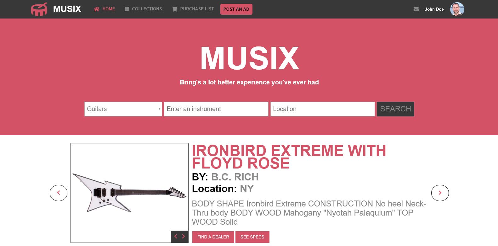

# Capstoe Project

> Musical Instruments Online Store.

Project description.

## Built With

- HTML5 and CSS3
- VSCode, Linters, Stylelint, Validator.w3

## Live Demo

:point_right: [Live Demo Link](https://rawcdn.githack.com/vzdrizhni/Capstone-project-Musical-instruments-online-shop/52dd387eb0b8a6b4f1bfeb324ae938d30270d66a/index.html)

## Video

:point_right: [Video presentation link](https://www.loom.com/share/302e4cc05e9642b684093becb5f37be8)

## About The Project

[![Product Name Screen Shot][product-screenshot]](./img/screenshot.png)

This project is a Capstone Project. Capstone projects are solo projects at the end of the each of the Microverse Main Technical Curriculum modules.

Here are the objectives for this project:

* Build 2 pages as the minimum requirements
	* the main page (search page), with a link to the results page
	* the search results page

* Each of these pages have versions for 2 different screen sizes
  * mobile: up to 768px
  * tablet: up to 1024px 

* Followed the guidelines of the given design, including:
  * colors
  * typographies: font face, size and weight
  * layout: composition and space between elements, for the 2 given screen sizes

### Built With
This project was built using these technologies.
* HTML
* CSS3
* Stickler
* VsCode

## Author

👤 Roman Nikolaev 

- Github: [@githubhandle](https://github.com/vzdrizhni)
- Twitter: [@twitterhandle](https://twitter.com/twitterhandle)
- Linkedin: [linkedin](https://twitter.com/metabruta)

## Show your support

Give a ⭐️ if you like this project!

## Credit

Original site design by [Mohammed Awad on Behance](https://www.behance.net/gallery/24796463/ZATTIX)

## Acknowledgments

* [Microverse](https://www.microverse.org/)
* [The Odin Project](https://www.theodinproject.com/)
* [HTML Cheat Sheet](https://htmlcheatsheet.com/js/)

## 📝 License

